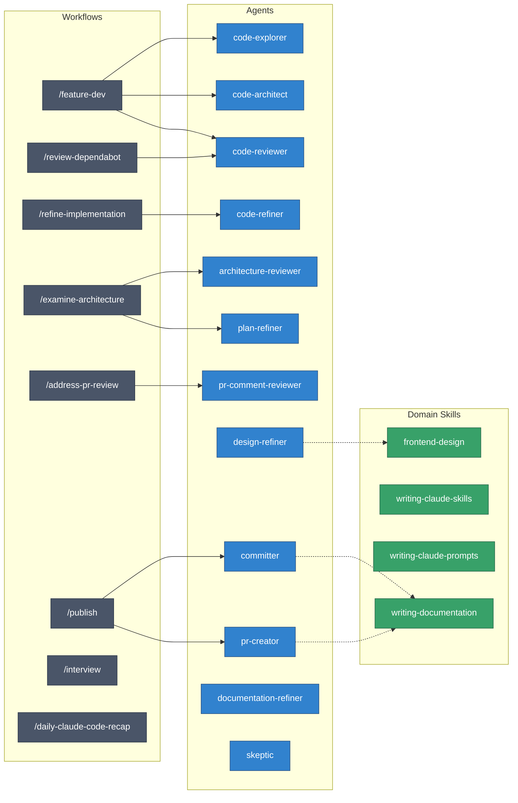

# AI Coding Agent Configuration

Custom agents and skills for Claude Code and compatible AI coding tools.

## Overview

```
agents/               Specialized subagents spawned by workflows
skills/               Workflows, domain knowledge, and context-activated expertise

AGENTS.md             Shared instructions (symlinked to ~/.claude/CLAUDE.md)
mcp.json              MCP server definitions (source of truth)
claude-settings.json  Claude Code settings (permissions, model)
generate-mcp.sh       Syncs MCP config to Claude Desktop and CLI
statusline.sh         Custom statusline for Claude Code
```

---

## Architecture

Workflows orchestrate multi-step processes by spawning agents, which may load domain skills for expertise.



**Legend**: Workflows (gray) → spawn Agents (blue) → load Domain Skills (green)

---

## Workflows

Workflows orchestrate multi-step processes, often spawning agents.

| Workflow                   | Purpose                                            | Agents Used                                  |
| -------------------------- | -------------------------------------------------- | -------------------------------------------- |
| `/feature-dev`             | Guided feature development (accepts Linear issues) | code-explorer, code-architect, code-reviewer |
| `/refine-implementation`   | Multi-pass quality review before committing        | code-refiner                                 |
| `/examine-architecture`    | Evaluate codebase for structural problems          | architecture-reviewer, plan-refiner          |
| `/address-pr-review`       | Resolve unresolved PR review comments              | pr-comment-reviewer                          |
| `/review-dependabot`       | Analyze and merge Dependabot PRs with safety check | code-reviewer                                |
| `/publish`                 | End-to-end release workflow (branch, PR, tag, npm) | committer, pr-creator                        |
| `/interview`               | Interview user about a plan before implementation  | -                                            |
| `/daily-claude-code-recap` | Summarize the day's Claude Code sessions           | -                                            |

---

## Agents

Subagents are spawned by workflows or invoked directly for focused tasks.

### Understanding Code

| Agent                     | Purpose                                                                  |
| ------------------------- | ------------------------------------------------------------------------ |
| **code-explorer**         | Traces execution paths, maps architecture layers, documents dependencies |
| **architecture-reviewer** | Evaluates existing code for brittleness, complexity, coupling            |

### Building Code

| Agent              | Purpose                                                      |
| ------------------ | ------------------------------------------------------------ |
| **code-architect** | Designs feature architectures with implementation blueprints |
| **plan-refiner**   | Validates implementation plans, suggests simpler approaches  |

### Reviewing Code

| Agent                   | Purpose                                                         |
| ----------------------- | --------------------------------------------------------------- |
| **code-reviewer**       | Reviews for bugs, security, conventions (confidence-filtered)   |
| **code-refiner**        | Simplifies complexity, improves maintainability                 |
| **pr-comment-reviewer** | Evaluates individual PR comments for actionability              |
| **skeptic**             | Challenges investigative conclusions before they reach the user |

### Git Workflow

| Agent                     | Purpose                                                       |
| ------------------------- | ------------------------------------------------------------- |
| **committer**             | Creates commits with conventional message format              |
| **pr-creator**            | Creates PRs with structured descriptions                      |
| **documentation-refiner** | Maintains Markdown files, package configs, and developer docs |

### Design

| Agent              | Purpose                                               |
| ------------------ | ----------------------------------------------------- |
| **design-refiner** | Iteratively refines frontend designs to 10/10 quality |

---

## Domain Skills

Domain skills provide expertise activated automatically by context.

### Development

| Skill               | Trigger                 |
| ------------------- | ----------------------- |
| **frontend-design** | Building web interfaces |

### Writing

| Skill                      | Trigger                     |
| -------------------------- | --------------------------- |
| **writing-documentation**  | Updating docs               |
| **writing-claude-skills**  | Creating Claude Code skills |
| **writing-claude-prompts** | Writing prompts for Claude  |

### Tools

| Skill                    | Trigger                     |
| ------------------------ | --------------------------- |
| **chartmogul-analytics** | Analyzing revenue metrics   |
| **task-management**      | GTD workflow with OmniFocus |
| **order-daycare-lunch**  | School lunch ordering       |

---

## Workflow Patterns

### Feature Development

```
/feature-dev "Add user authentication"
    │
    ├─→ Discovery: clarify requirements
    ├─→ Exploration: code-explorer (2-3x parallel)
    ├─→ Questions: resolve ambiguities (AskUserQuestion)
    ├─→ Architecture: code-architect (2-3x parallel)
    ├─→ Implementation: build the feature
    ├─→ Review: code-reviewer (3x parallel)
    └─→ Summary: document what was built
```

### Code Quality

```
/refine-implementation
    │
    ├─→ code-refiner: simplicity & elegance
    ├─→ code-refiner: configuration compliance
    ├─→ code-refiner: conventions & patterns
    └─→ Reconcile changes, iterate if needed
```

### Architecture Analysis

```
/examine-architecture
    │
    ├─→ architecture-reviewer (4-8x parallel, one per surface)
    ├─→ Consolidate findings
    └─→ plan-refiner: validate fixes
```

### Release Publishing

```
/publish
    │
    ├─→ Gather context (git status, current version)
    ├─→ Ask release type (patch/minor/major)
    ├─→ committer: create release commit
    ├─→ pr-creator: create release PR
    ├─→ Merge, tag, and push
    └─→ Monitor GitHub Actions release workflow
```

---

## Configuration

### MCP Servers

The `mcp.json` file defines MCP servers shared across tools:

| Server                  | Purpose                        |
| ----------------------- | ------------------------------ |
| **betterstack**         | Logging and uptime monitoring  |
| **chartmogul**          | Revenue analytics              |
| **google**              | Gmail and Calendar integration |
| **helpscout**           | Customer support               |
| **linear**              | Issue tracking integration     |
| **make**                | Workflow automation            |
| **memory**              | Persistent knowledge graph     |
| **notion**              | Workspace and docs             |
| **omnifocus**           | Task management                |
| **sentry**              | Error monitoring               |
| **sequential-thinking** | Step-by-step reasoning         |
| **stripe**              | Payment processing             |
| **ynab**                | Budget tracking                |

Run `./generate-mcp.sh` to sync servers to Claude Desktop and Claude CLI.

### Statusline

The `statusline.sh` script provides a custom prompt showing:

- Current directory
- Git branch with dirty/clean indicator
- Active model name

---

## Installation

DotBot symlinks this directory to the expected locations:

```
ai/AGENTS.md             → ~/.claude/CLAUDE.md
ai/claude-settings.json  → ~/.claude/settings.json
ai/agents/               → ~/.claude/agents/
ai/skills/               → ~/.claude/skills/
```

Run `./install` from the dotfiles root to set up symlinks.

---

## Tool Compatibility

| Tool               | How It Works                                   |
| ------------------ | ---------------------------------------------- |
| **Claude Code**    | Native support for all files in this directory |
| **Claude Desktop** | MCP servers synced via `generate-mcp.sh`       |
