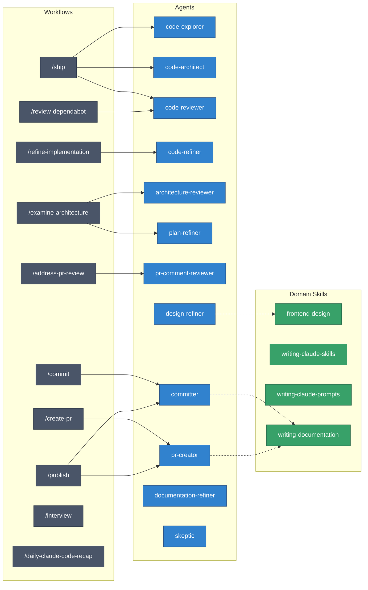

# AI Coding Agent Configuration

Custom agents, skills, and workflows for Claude Code.

## Install as a Plugin

This repository serves as a Claude Code plugin marketplace. To install:

```bash
# Add the marketplace
/plugin marketplace add stephendolan/dotfiles

# Install the plugin
/plugin install stephendolan@dotfiles
```

Skills become available as `/stephendolan:commit`, `/stephendolan:create-pr`, etc.

### Local Development

```bash
# Test locally without installing
claude --plugin-dir ./ai

# Pick up changes during development
/reload-plugins
```

### Plugin Structure

The `ai/` directory is the plugin root:

```
ai/
  .claude-plugin/
    plugin.json          Plugin manifest
  agents/                Subagent definitions
  skills/                Slash command workflows and domain expertise
  hooks/                 Event handlers
  AGENTS.md              Shared instructions
  mcp.json               MCP server definitions
  claude-settings.json   Default settings
  statusline.sh          Custom statusline
```

> For the author's personal dotfiles setup, DotBot symlinks this directory to `~/.claude/`. Run `./install` from the repo root.

---

## Architecture

Workflows orchestrate multi-step processes by spawning agents, which may load domain skills for expertise.


```mermaid
flowchart LR
    subgraph Workflows
        cm["/commit"]
        cpr["/create-pr"]
        fd["/ship"]
        ri["/refine-implementation"]
        ea["/examine-architecture"]
        apr["/address-pr-review"]
        rd["/review-dependabot"]
        pub["/publish"]
        int["/interview"]
        dcr["/daily-claude-code-recap"]
    end

    subgraph Agents
        ce["code-explorer"]
        ca["code-architect"]
        cr["code-reviewer"]
        cf["code-refiner"]
        ar["architecture-reviewer"]
        pr["plan-refiner"]
        pcr["pr-comment-reviewer"]
        com["committer"]
        prc["pr-creator"]
        dr["design-refiner"]
        docr["documentation-refiner"]
        sk["skeptic"]
    end

    subgraph Domain Skills
        fdd["frontend-design"]
        wcs["writing-claude-skills"]
        wcp["writing-claude-prompts"]
        wdoc["writing-documentation"]
    end

    cm --> com
    cpr --> prc
    fd --> ce & ca & cr
    ri --> cf
    ea --> ar & pr
    apr --> pcr
    rd --> cr
    pub --> com & prc

    com -.-> wdoc
    prc -.-> wdoc
    dr -.-> fdd

    classDef workflow fill:#4a5568,stroke:#2d3748,color:#fff
    classDef agent fill:#3182ce,stroke:#2c5282,color:#fff
    classDef skill fill:#38a169,stroke:#276749,color:#fff

    class cm,cpr,fd,ri,ea,apr,rd,pub,int,dcr workflow
    class ce,ca,cr,cf,ar,pr,pcr,com,prc,dr,docr,sk agent
    class fdd,wcs,wcp,wdoc skill
```

**Legend**: Workflows (gray) spawn Agents (blue) which load Domain Skills (green)

---

## Workflows

| Workflow                   | Purpose                                            |
| -------------------------- | -------------------------------------------------- |
| `/commit`                  | Commit with conventional message (why > what)      |
| `/create-pr`               | Create PR with concise description                 |
| `/ship`                    | Autonomous end-to-end feature development          |
| `/refine-implementation`   | Multi-pass quality review before committing        |
| `/examine-architecture`    | Evaluate codebase for structural problems          |
| `/address-pr-review`       | Resolve unresolved PR review comments              |
| `/review-dependabot`       | Analyze and merge Dependabot PRs with safety check |
| `/publish`                 | End-to-end release workflow (branch, PR, tag, npm) |
| `/interview`               | Interview user about a plan before implementation  |
| `/daily-claude-code-recap` | Summarize the day's Claude Code sessions           |
| `/github-overview`         | GitHub PR dashboard for organization               |

### Execution Flow Examples

```
/ship "Add user authentication"
  Discovery -> Exploration (code-explorer) -> Architecture (code-architect)
  -> Implementation -> Review (code-reviewer) -> Summary

/refine-implementation
  code-refiner: simplicity -> configuration compliance -> conventions
  -> Reconcile changes, iterate if needed

/examine-architecture
  architecture-reviewer (parallel, one per surface)
  -> Consolidate findings -> plan-refiner validates fixes

/publish
  Gather context -> Ask release type -> committer: release commit
  -> pr-creator: release PR -> Merge, tag, push -> Monitor CI
```

---

## Agents

| Agent                     | Purpose                                            |
| ------------------------- | -------------------------------------------------- |
| **code-explorer**         | Trace execution paths, map dependencies            |
| **code-architect**        | Design feature architectures                       |
| **code-reviewer**         | Review for bugs, security, conventions             |
| **code-refiner**          | Simplify complexity, improve maintainability       |
| **architecture-reviewer** | Evaluate brittleness, complexity, coupling         |
| **plan-refiner**          | Validate plans, suggest simpler approaches         |
| **pr-comment-reviewer**   | Evaluate PR comments for actionability             |
| **committer**             | Create commits with conventional messages          |
| **pr-creator**            | Create PRs with structured descriptions            |
| **design-refiner**        | Iteratively refine frontend designs                |
| **documentation-refiner** | Maintain Markdown files and developer docs         |
| **skeptic**               | Challenge conclusions before they reach the user   |

---

## Domain Skills

Domain skills provide expertise activated automatically by context.

| Skill                      | Trigger                     |
| -------------------------- | --------------------------- |
| **frontend-design**        | Building web interfaces     |
| **writing-documentation**  | Updating docs               |
| **writing-claude-skills**  | Creating Claude Code skills |
| **writing-claude-prompts** | Writing prompts for Claude  |
| **cooking**                | Recipes and meal planning   |
| **drama-triangle**         | Communication and conflict analysis |
| **chartmogul-analytics**   | Analyzing revenue metrics   |
| **task-management**        | GTD workflow with OmniFocus |
| **order-daycare-lunch**    | School lunch ordering       |

---

## MCP Servers

The `mcp.json` file defines MCP server connections:

| Server          | Purpose                       |
| --------------- | ----------------------------- |
| **betterstack** | Logging and uptime monitoring |
| **chartmogul**  | Revenue analytics             |
| **helpscout**   | Customer support              |
| **omnifocus**   | Task management               |
| **superset**    | Data exploration              |
| **ynab**        | Budget tracking               |

Run `./generate-mcp.sh` to sync servers to Claude CLI and Codex CLI.
