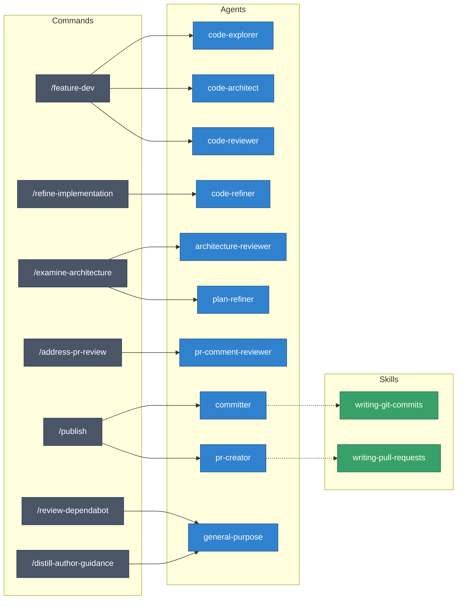

# AI Coding Agent Configuration

Custom agents, commands, and skills for Claude Code and compatible AI coding tools.

## Overview

```
commands/           Slash commands that orchestrate workflows
agents/             Specialized subagents spawned by commands
skills/             Domain knowledge activated by context
hooks/              Claude Code hooks for automation
opencode/           OpenCode-specific configuration

AGENTS.md           Shared instructions (symlinked to ~/.claude/CLAUDE.md)
mcp.json            MCP server definitions (source of truth)
claude-settings.json Claude Code settings (permissions, hooks, model)
generate-mcp.sh     Syncs MCP config to Claude Desktop, OpenCode, and CLI
statusline.sh       Custom statusline for Claude Code
```

---

## Architecture

Commands orchestrate workflows by spawning agents, which may load skills for domain expertise.


```mermaid
flowchart LR
    subgraph Commands
        fd["/feature-dev"]
        ri["/refine-implementation"]
        ea["/examine-architecture"]
        apr["/address-pr-review"]
        rd["/review-dependabot"]
        pub["/publish"]
        dag["/distill-author-guidance"]
    end

    subgraph Agents
        ce["code-explorer"]
        ca["code-architect"]
        cr["code-reviewer"]
        cf["code-refiner"]
        ar["architecture-reviewer"]
        pr["plan-refiner"]
        pcr["pr-comment-reviewer"]
        com["committer"]
        prc["pr-creator"]
        gp["general-purpose"]
    end

    subgraph Skills
        wgc["writing-git-commits"]
        wpr["writing-pull-requests"]
    end

    fd --> ce & ca & cr
    ri --> cf
    ea --> ar & pr
    apr --> pcr
    rd --> gp
    pub --> com & prc
    dag --> gp

    com -.-> wgc
    prc -.-> wpr

    classDef cmd fill:#4a5568,stroke:#2d3748,color:#fff
    classDef agent fill:#3182ce,stroke:#2c5282,color:#fff
    classDef skill fill:#38a169,stroke:#276749,color:#fff

    class fd,ri,ea,apr,rd,pub,dag cmd
    class ce,ca,cr,cf,ar,pr,pcr,com,prc,gp agent
    class wgc,wpr skill
```

**Legend**: Commands (gray) → spawn Agents (blue) → load Skills (green)

---

## Commands

Slash commands orchestrate multi-step workflows, often spawning agents.

| Command                    | Purpose                                            | Agents Used                                  |
| -------------------------- | -------------------------------------------------- | -------------------------------------------- |
| `/feature-dev`             | Guided feature development (accepts Linear issues) | code-explorer, code-architect, code-reviewer |
| `/refine-implementation`   | Multi-pass quality review before committing        | code-refiner                                 |
| `/examine-architecture`    | Evaluate codebase for structural problems          | architecture-reviewer, plan-refiner          |
| `/address-pr-review`       | Resolve unresolved PR review comments              | pr-comment-reviewer                          |
| `/review-dependabot`       | Analyze and merge Dependabot PRs with safety check | general-purpose                              |
| `/publish`                 | End-to-end release workflow (branch, PR, tag, npm) | committer, pr-creator                        |
| `/distill-author-guidance` | Extract coding patterns from an author's history   | general-purpose                              |

---

## Agents

Subagents are spawned by commands or invoked directly for focused tasks.

### Understanding Code

| Agent                     | Purpose                                                                  |
| ------------------------- | ------------------------------------------------------------------------ |
| **code-explorer**         | Traces execution paths, maps architecture layers, documents dependencies |
| **architecture-reviewer** | Evaluates existing code for brittleness, complexity, coupling            |

### Building Code

| Agent              | Purpose                                                      |
| ------------------ | ------------------------------------------------------------ |
| **code-architect** | Designs feature architectures with implementation blueprints |
| **plan-refiner**   | Validates implementation plans, suggests simpler approaches  |

### Reviewing Code

| Agent                   | Purpose                                                       |
| ----------------------- | ------------------------------------------------------------- |
| **code-reviewer**       | Reviews for bugs, security, conventions (confidence-filtered) |
| **code-refiner**        | Simplifies complexity, improves maintainability               |
| **pr-comment-reviewer** | Evaluates individual PR comments for actionability            |

### Git Workflow

| Agent                     | Purpose                                          |
| ------------------------- | ------------------------------------------------ |
| **committer**             | Creates commits with conventional message format |
| **pr-creator**            | Creates PRs with structured descriptions         |
| **documentation-refiner** | Maintains README, CHANGELOG, and project docs    |

---

## Skills

Skills provide domain expertise activated automatically by context.

### Development

| Skill                          | Trigger                         |
| ------------------------------ | ------------------------------- |
| **ruby-idioms**                | Writing Ruby code               |
| **ruby-rspec**                 | Writing RSpec tests             |
| **rails-controllers**          | Writing Rails controllers       |
| **rails-jobs**                 | Creating background jobs        |
| **rails-migrations**           | Writing database migrations     |
| **javascript-tooling**         | Setting up JS/TS build tools    |
| **cpp-native-development**     | Writing C++17/20 code           |
| **macos-native-development**   | Writing macOS/Swift/AppKit code |
| **windows-native-development** | Writing Windows/Win32 code      |
| **frontend-design**            | Building web interfaces         |

### Writing

| Skill                      | Trigger                    |
| -------------------------- | -------------------------- |
| **writing-git-commits**    | Committing code            |
| **writing-pull-requests**  | Creating PRs               |
| **writing-documentation**  | Updating docs              |
| **writing-claude-skills**  | Creating skills            |
| **writing-claude-prompts** | Writing prompts for Claude |

### Tools

| Skill                    | Trigger                   |
| ------------------------ | ------------------------- |
| **chartmogul-analytics** | Analyzing revenue metrics |
| **project-management**   | Planning tasks and work   |
| **order-daycare-lunch**  | School lunch ordering     |

---

## Workflow Patterns

### Feature Development

```
/feature-dev "Add user authentication"
    │
    ├─→ Discovery: clarify requirements
    ├─→ Exploration: code-explorer (2-3x parallel)
    ├─→ Questions: resolve ambiguities (AskUserQuestion)
    ├─→ Architecture: code-architect (2-3x parallel)
    ├─→ Implementation: build the feature
    ├─→ Review: code-reviewer (3x parallel)
    └─→ Summary: document what was built
```

### Code Quality

```
/refine-implementation
    │
    ├─→ code-refiner: simplicity & elegance
    ├─→ code-refiner: configuration compliance
    ├─→ code-refiner: conventions & patterns
    └─→ Reconcile changes, iterate if needed
```

### Architecture Analysis

```
/examine-architecture
    │
    ├─→ architecture-reviewer (4-8x parallel, one per surface)
    ├─→ Consolidate findings
    └─→ plan-refiner: validate fixes
```

### Release Publishing

```
/publish
    │
    ├─→ Gather context (git status, current version)
    ├─→ Ask release type (patch/minor/major)
    ├─→ committer: create release commit
    ├─→ pr-creator: create release PR
    ├─→ Merge, tag, and push
    └─→ Monitor GitHub Actions release workflow
```

---

## Configuration

### MCP Servers

The `mcp.json` file defines MCP servers shared across tools:

| Server               | Purpose                        |
| -------------------- | ------------------------------ |
| **linear**           | Issue tracking integration     |
| **notion**           | Workspace and docs             |
| **sentry**           | Error monitoring               |
| **mixpanel**         | Product analytics              |
| **betterstack**      | Logging and uptime             |
| **context7**         | Library documentation lookup   |
| **memory**           | Persistent knowledge graph     |
| **sequential-thinking** | Step-by-step reasoning      |
| **browsermcp**       | Browser automation             |

Run `./generate-mcp.sh` to sync servers to Claude Desktop, OpenCode, and Claude CLI.

### Hooks

| Hook                      | Trigger      | Purpose                                      |
| ------------------------- | ------------ | -------------------------------------------- |
| **log-unapproved.sh**     | PreToolUse   | Logs Bash commands for allow-list refinement |
| **review-permissions.sh** | Manual       | Reviews logged permission prompts            |

Run `hooks/review-permissions.sh` to see which commands are prompting for permission, then add patterns to `claude-settings.json`.

### Statusline

The `statusline.sh` script provides a custom prompt showing:
- Current directory
- Git branch with dirty/clean indicator
- Active model name

---

## Installation

DotBot symlinks this directory to the expected locations:

```
ai/AGENTS.md           → ~/.claude/CLAUDE.md
ai/claude-settings.json → ~/.claude/settings.json
ai/agents/             → ~/.claude/agents/
ai/commands/           → ~/.claude/commands/
ai/skills/             → ~/.claude/skills/
ai/hooks/              → ~/.claude/hooks/
ai/opencode/config.json → ~/.config/opencode/opencode.json
```

Run `./install` from the dotfiles root to set up symlinks.

---

## Tool Compatibility

This configuration works with multiple AI coding tools:

| Tool             | How It Works                                                      |
| ---------------- | ----------------------------------------------------------------- |
| **Claude Code**  | Native support for all files in this directory                    |
| **OpenCode**     | Uses [oh-my-opencode](https://github.com/code-yeongyu/oh-my-opencode) plugin to read `~/.claude/` |
| **Claude Desktop** | MCP servers synced via `generate-mcp.sh`                        |

### OpenCode Setup

OpenCode reads instructions from `~/.claude/CLAUDE.md` via the oh-my-opencode plugin. The `opencode/config.json` contains:
- Plugin configuration
- Permission rules mirroring `claude-settings.json`
- MCP servers (generated from `mcp.json`)
